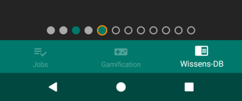

# Progress Page Indicator for Android


This library provides an easy to use progress page indicator with the possibility to use different representations dependent  on the specific context. Meaningful for - as example - also displaying the quantity of questions in a questionnaire with further information about the context (un-/visited, un-/answered or active) of each of them.
## How to use
### Import with gradle
1. Add **jitpack.io** in your root *build.gradle* at the end of repositories:

	```groovy
    allprojects {
        repositories {
            ...
            maven { url 'https://jitpack.io' }
        }
    }
	```
2. Add Progress -Page-Indicator dependency:
	```groovy
    dependencies {
        implementation 'com.github.C0d3ggz:Android-Progress-Page-Indicator:v1.0.0'
    }
	```

### Add manually
1. download the [latest release](https://github.com/C0d3GGz/Android-Progress-Page-Indicator/releases/latest)
2. import the library into your project as described in the [android docs](https://developer.android.com/studio/projects/android-library#AddDependency)


### Create ProgressPageIndicator
You can define the ProgressPageIndicator both with xml and programmatic as in the following explained.
#### xml
Specify the *app* namespace for your layout by adding `xmlns:app="http://schemas.android.com/apk/res-auto"`. 
Define the colors `colorPrimary` for primary, `colorSecondary` for secondary progress and `backgroundDefault` for the background color.


```xml

```
#### programmatic
```java

```
## Example
Sample implementation of ProgressPageIndicators for each question in a questionnaire. Each indicator represents a question whereat the blank ones are **unvisited**, the filled ones are either **visited** (gray color) or **visited and answered** (green). Also the indicator with the orange highlightin is the currently **active** question.

